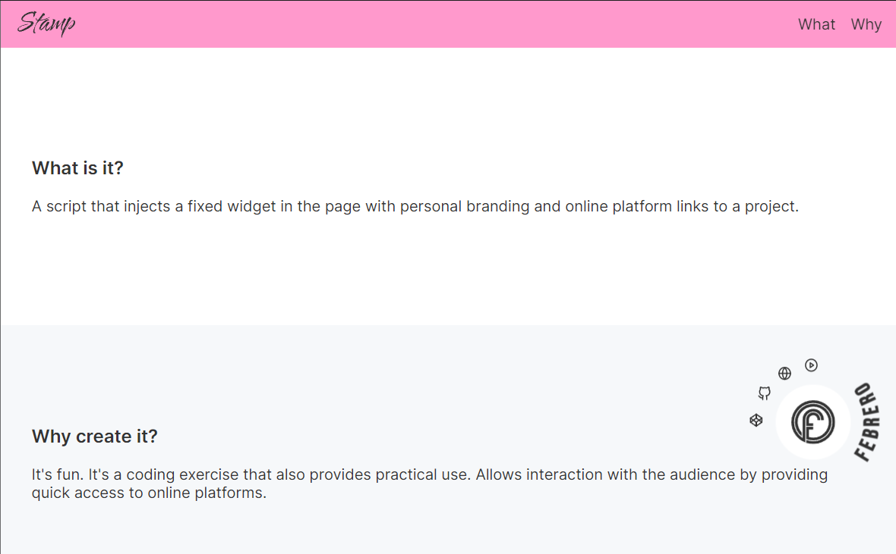

# Stamp

Project branding and web platform direction.

## What is it?

A script that injects a fixed widget in the page with personal branding and online platform links to a project.

## Why create it?

It's fun. It's a coding exercise that also provides practical use. Allows interaction with the audience by providing quick access to online platforms.
